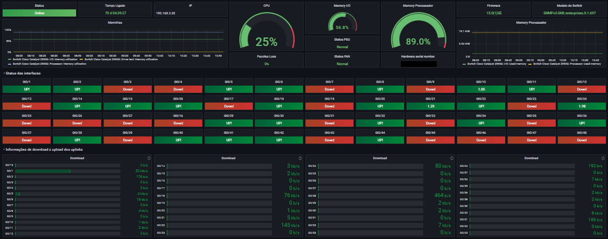
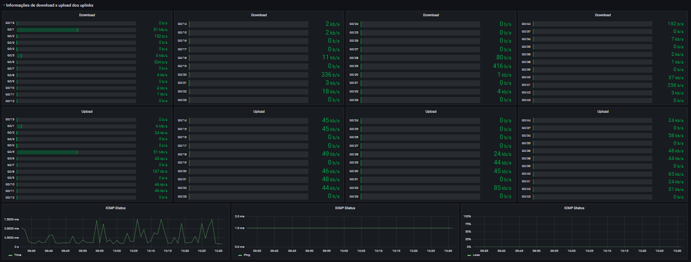

# dashboard_cisco_switch_grafana

**Dashboard Cisco - Grafana**

Monitoramento:
CPU
Memória RAM
ICMP - Ping, Time, Loss
Portas Ativas e Desativadas
Informações
Bandwith Upload
Bandwith Download

*Dashboard construída com foco em métricas Switchs Cisco.*

Switch usado na dashboard = *Switch Cisco 2960*

Data Soure = *alexanderzobnin-zabbix-datasource*

Dúvidas ou sugestões = *marcusronney@outlook.com*
